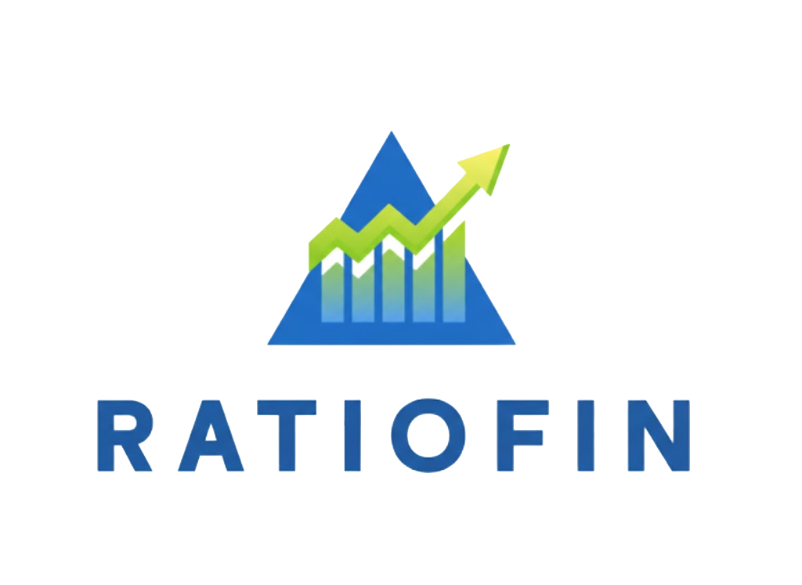

<br />
<div align="center">
  <a href="https://github.com/andromeda2910/ratio-fin/tree/main/ratio-fin">
    
  </a>

<h3 align="center">RatioFin</h3>

  <p align="center">
    A personal/business financial health analyzer dashboard with real-time calculations and professional PDF reporting.
    <br />
    <a href="https://github.com/andromeda2910/ratio-fin/tree/main/ratio-fin"><strong>Explore the docs »</strong></a>
    <br />
    <br />
    <a href="https://github.com/andromeda2910/ratio-fin/tree/main/ratio-fin">View Demo</a>
    ·
    <a href="https://github.com/andromeda2910/ratio-fin/issues">Report Bug</a>
    ·
    <a href="https://github.com/andromeda2910/ratio-fin/issues">Request Feature</a>
  </p>
</div>


<!-- TABLE OF CONTENTS -->
<details>
  <summary>Table of Contents</summary>
  <ol>
    <li>
      <a href="#about-the-project">About The Project</a>
      <ul>
        <li><a href="#built-with">Built With</a></li>
      </ul>
    </li>
    <li>
      <a href="#getting-started">Getting Started</a>
      <ul>
        <li><a href="#prerequisites">Prerequisites</a></li>
        <li><a href="#installation">Installation</a></li>
      </ul>
    </li>
    <li><a href="#usage">Usage</a></li>
    <li><a href="#roadmap">Roadmap</a></li>
    <li><a href="#contributing">Contributing</a></li>
    <li><a href="#license">License</a></li>
    <li><a href="#contact">Contact</a></li>
    <li><a href="#acknowledgments">Acknowledgments</a></li>
  </ol>
</details>


<!-- ABOUT THE PROJECT -->
## About The Project

[![Product Name Screen Shot][product-screenshot]](public/preview-dashboard.png)

RatioFin is a modern, responsive web application designed for business owners and financial analysts to measure financial health across multiple years (up to 3 years of comparison). It provides instant insights into liquidity, profitability, and capital efficiency through key financial ratios.

Key Features:
* **Interactive Dashboard:** Input financial data with automatic formatting (Ribuan/Thousands separator).
* **Automated Ratio Analysis:** Instantly calculates Current Ratio, Net Profit Margin (NPM), and Return on Equity (ROE).
* **Comprehensive Health Score:** Multi-dimensional health score (0-100) based on financial metrics.
* **Smart Data Visualizations:** Trend analysis line charts and strength radar charts using Recharts.
* **Premium PDF Reporting:** Generate and download professional financial reports with one click.

<p align="right">(<a href="#readme-top">back to top</a>)</p>


### Built With

* [![React][React.js]][React-url]
* [![Vite][Vite.js]][Vite-url]
* [![TailwindCSS][Tailwind.css]][Tailwind-url]
* [![LucideIcons][Lucide.icons]][Lucide-url]
* [![Recharts][Recharts.js]][Recharts-url]

<p align="right">(<a href="#readme-top">back to top</a>)</p>


<!-- GETTING STARTED -->
## Getting Started

To get a local copy up and running, follow these simple steps.

### Prerequisites

* npm
  ```sh
  npm install npm@latest -g
  ```

### Installation

1. Clone the repo
   ```sh
   git clone https://github.com/andromeda2910/ratio-fin.git
   ```
2. Install NPM packages
   ```sh
   npm install
   ```
3. Enter your API keys in `.env` (if using Supabase/Auth features)
   ```js
   VITE_SUPABASE_URL="YOUR_URL"
   VITE_SUPABASE_ANON_KEY="YOUR_KEY"
   ```
4. Start the development server
   ```sh
   npm run dev
   ```

<p align="right">(<a href="#readme-top">back to top</a>)</p>


<!-- USAGE EXAMPLES -->
## Usage

1. **Input General Data:** Enter your company name for the report header.
2. **Add Data Rows:** Input data for the current year. Click "Tambah Tahun" to add previous years for comparison.
3. **Analyze:** Click "Analisis Sekarang" to see the modal dashboard with scores and charts.
4. **Export:** Click "Download Laporan (PDF)" to save a copy for your records or presentations.

_For more examples, please refer to the [Documentation](https://github.com/andromeda2910/ratio-fin/tree/main/ratio-fin)_

<p align="right">(<a href="#readme-top">back to top</a>)</p>


<!-- ROADMAP -->
## Roadmap

- [ ] Add more financial ratios (Debt-to-Equity, Asset Turnover).
- [ ] User authentication with Supabase for data persistence.
- [ ] Dark mode support.
- [ ] Multi-currency support.

See the [open issues](https://github.com/andromeda2910/ratio-fin/issues) for a full list of proposed features (and known issues).

<p align="right">(<a href="#readme-top">back to top</a>)</p>


<!-- CONTRIBUTING -->
## Contributing

Contributions are what make the open source community such an amazing place to learn, inspire, and create. Any contributions you make are **greatly appreciated**.

If you have a suggestion that would make this better, please fork the repo and create a pull request. You can also simply open an issue with the tag "enhancement".
Don't forget to give the project a star! Thanks again!

1. Fork the Project
2. Create your Feature Branch (`git checkout -b feature/AmazingFeature`)
3. Commit your Changes (`git commit -m 'Add some AmazingFeature'`)
4. Push to the Branch (`git push origin feature/AmazingFeature`)
5. Open a Pull Request

<p align="right">(<a href="#readme-top">back to top</a>)</p>


<!-- LICENSE -->
## License

Distributed under the MIT License. See `LICENSE` for more information.

<p align="right">(<a href="#readme-top">back to top</a>)</p>


<!-- CONTACT -->
## Contact

andromeda2910 - [GitHub](https://github.com/andromeda2910)

Project Link: [https://github.com/andromeda2910/ratio-fin/tree/main/ratio-fin](https://github.com/andromeda2910/ratio-fin/tree/main/ratio-fin)

<p align="right">(<a href="#readme-top">back to top</a>)</p>


<!-- ACKNOWLEDGMENTS -->
## Acknowledgments

* [Recharts Library](https://recharts.org/)
* [Lucide React Icons](https://lucide.dev/)
* [html2pdf.js](https://github.com/eKoopmans/html2pdf.js)

<p align="right">(<a href="#readme-top">back to top</a>)</p>


<!-- MARKDOWN LINKS & IMAGES -->
[product-screenshot]: public/preview-dashboard.png
[React.js]: https://img.shields.io/badge/React-20232A?style=for-the-badge&logo=react&logoColor=61DAFB
[React-url]: https://reactjs.org/
[Vite.js]: https://img.shields.io/badge/Vite-646CFF?style=for-the-badge&logo=vite&logoColor=FFD62E
[Vite-url]: https://vitejs.dev/
[Tailwind.css]: https://img.shields.io/badge/Tailwind_CSS-38B2AC?style=for-the-badge&logo=tailwind-css&logoColor=white
[Tailwind-url]: https://tailwindcss.com/
[Lucide.icons]: https://img.shields.io/badge/Lucide-000000?style=for-the-badge&logo=lucide&logoColor=white
[Lucide-url]: https://lucide.dev/
[Recharts.js]: https://img.shields.io/badge/Recharts-22b5bf?style=for-the-badge&logo=recharts&logoColor=white
[Recharts-url]: https://recharts.org/
